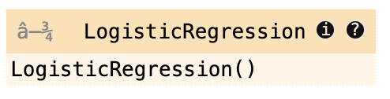

# mlaas-workshop

## Installation

1. Create a virtual environment with Python 3.10
2. Run the following from the env:
  ```cmd
  $ pip install -r requirements.txt
  ```

## Verifying the installation

1. Navigate to the `test` directory in this repository, and run the following command:
  ```cmd
  $ gramex
  ```
2. This will launch a server process. Wait for it to get booted up. When you see the following lines:

  ```
    INFO    22-Apr 13:34:26 __init__ PORT Listening on port 9988
    INFO    22-Apr 13:34:26 __init__ 9988 <Ctrl-B> opens the browser...

  ```
  your server is ready to begin.

3. Open a browser and go to [http://localhost:9988](http://localhost:9988). You should see something like this:


